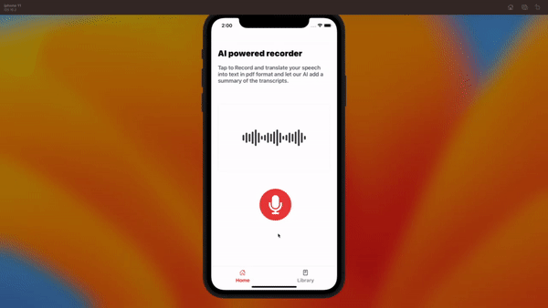

# AI Speech Text

## Overview

A Mobile app to help translate voice to text and generate a downloadable file with a summarized verison of the text added using an AI tool which helps users to easily understand the context of the transcript .


## Demo 



[Full  demo on loom](https://www.loom.com/share/7ccffa30cc3040a5bf238c628853110f)


Application Architechure Overview


## Technologies

- [React native expo managed workflow for development + Typescript](https://expo.dev/tools)

- [Open AI tool](https://platform.openai.com/overview)

- [React native voice module](https://www.npmjs.com/package/@react-native-voice/voice)

## Available Scripts

### Install

```
yarn install
```

### Adding Environment Variables

```
cp .env.sample .env
```

This will copy the sample environment variables into the newly created `.env` required to get started.

Please enter the following env required in the .env file for this app to work correctly

```

# Open API (Required)
OPENAI_API_KEY=

# EAS project id (Required for eas build)
EXPO_PROJECT_ID=

```

### Run dev environment

This project uses expo managed workflow so ensure you have the expo-cli installed globally on your machine see link for[ guide here ](https://docs.expo.dev/get-started/installation/#expo-cli)

```
yarn ios
```

for runinng the project in ios simulator

> **Please note Android native module not implemented**


```
yarn android
```

for runinng the project in an android emulator

### Distribution

This project uses expo application service (EAS) for creating builds and submissions so ensure you have the eas-cli installed globally on your machine see link for [guide here](https://docs.expo.dev/eas/)

#### EAS Staging profile


in-order to test for internal distribution on your ios follow the instructions of this  [Link](https://expo.dev/register-device/b293a506-708a-498e-9349-585760363a01) to register your device .

- Create Builds

```
yarn build:staging:ios
```


```
yarn build:staging:android
```
